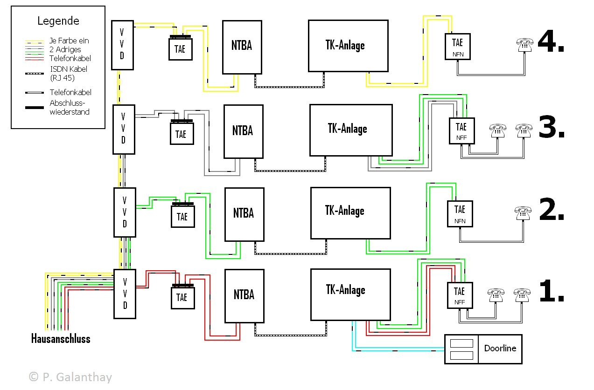

## Inhouse-Installation

Den Arbeitsauftrag „Inhouse-Installation“ begannen wir mit der Planung der Verkabelung. Als diese fertig war, fertigten wir einen Schaltplan an und fingen an die Anlage aufzubauen. Zum Schluss mussten wir sie noch konfigurieren.

### Schaltplan:

Bei dem Schaltplan entschieden wir uns die 4 VVDs hintereinander zu setzen, dahinter schlossen wir den ISDN-NTBA und die TK-Anlagen an. Mit der TK-Anlagen verbanden wir verschiedene TAE Dosen und eine Doorline.

### Aufbau der ISDN-Anlage:

Als Erstes haben wir die vier VVDs in gleicher Höhe an der Montagewand angebracht und mit der zehnadrigen Leitung an den Verteiler angeschlossen.
Hinter der VVD schlossen wir eine TAE mit einem Abschlusswiderstand, an welche wiederum der NTBA kam. Nun kam die eigentliche TK-Anlage.
Von der Anlage aus ging, je nach Auftrag, eine bzw. mehrere Leitungen zu einer weiteren TAE Dose, an die analoge Telefone angebracht werden konnten.
Zusätzlich verbanden wir eine Doorline an die TK-Anlage an.
### Konfigurieren der Anlage:

Das Einstellen der Anlage gestaltete sich mit unter am schwierigsten, da es mehrere Probleme mit den Treibern für die Computerkonfiguration gab bzw. wir uns erst in die Telefonkonfiguration einarbeiten mussten.

An eine der Telefonanlagen schlossen wir einen Laptop an und mussten erst sämtliche Treiber und Software für die Konfiguration installieren. Als dies abgeschlossen war, konnten wir die Anlage relativ einfach über Software konfigurieren.
Die andere Anlage versuchten wir mit dem Telefon einzustellen.